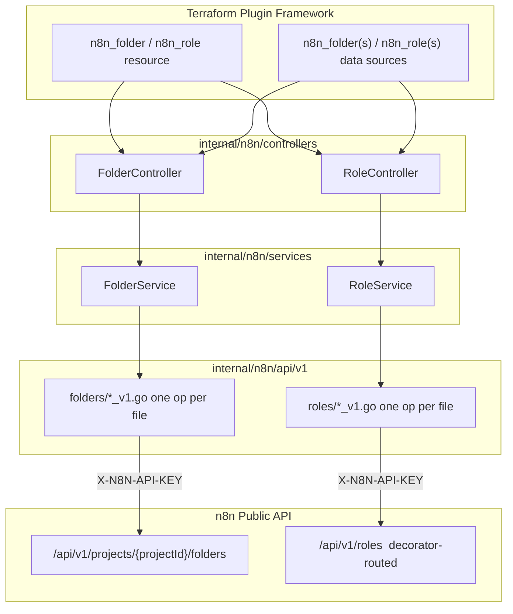
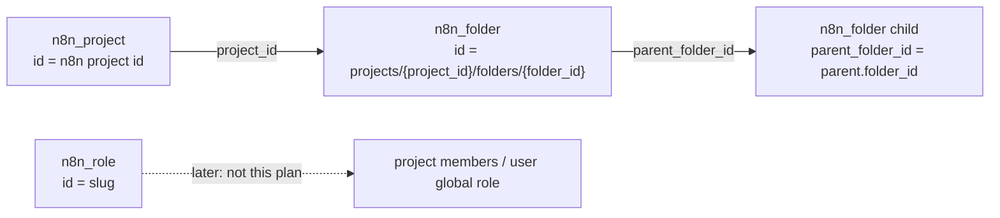
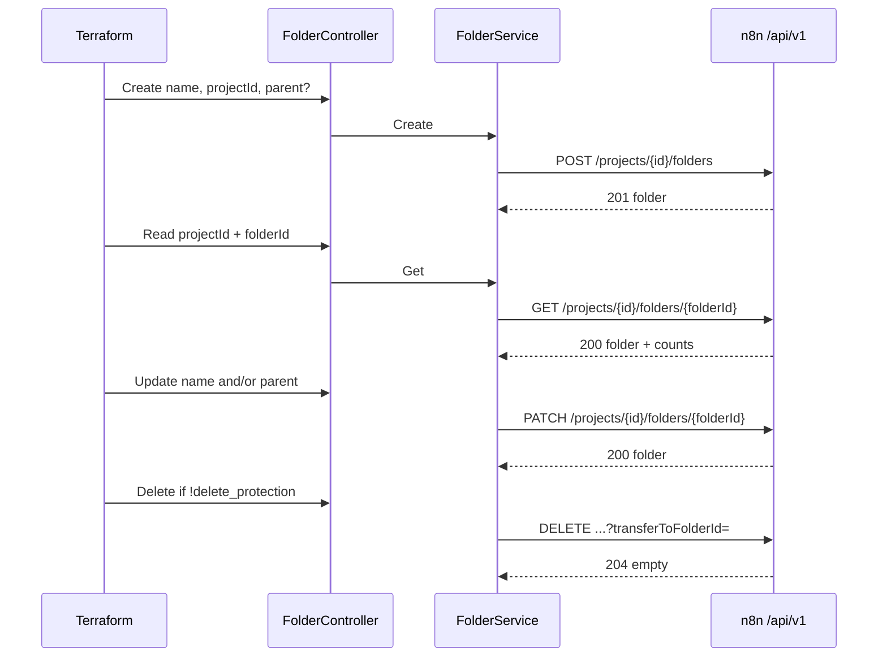
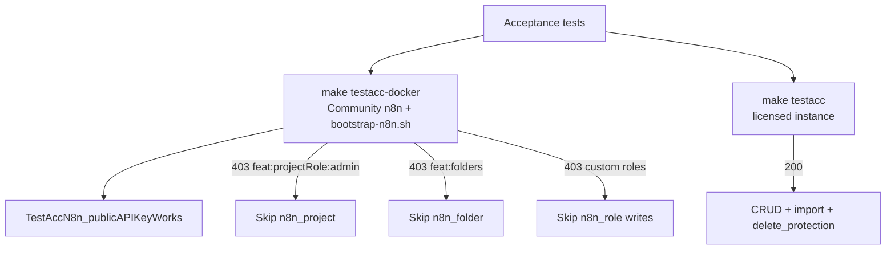

# n8n Folders then Role Catalog Implementation Plan

> **For agentic workers:** REQUIRED SUB-SKILL: Use superpowers:subagent-driven-development (recommended) or superpowers:executing-plans to implement this plan task-by-task. Steps use checkbox (`- [ ]`) syntax for tracking.

**Goal:** Add Terraform types for n8n project folders (Wave A), then a custom-role catalog (Wave B), without role assignment and without treating docs as the live contract.

**Architecture:** Keep the existing stack: Terraform types call `internal/n8n/controllers`, controllers call `internal/n8n/services`, services call one HTTP op per file under `internal/n8n/api/v1/<resource>`. Folders are project-scoped with GET-by-id. Roles are instance-scoped, decorator-routed Public API ops whose index registration must be live-verified before Wave B code.

**Tech Stack:** Go, Terraform Plugin Framework, n8n Public API `/api/v1` with header `X-N8N-API-KEY`, HashiCorp terraform-plugin-testing, Docker Compose Community n8n (`docker-compose.dev.yml` + `scripts/bootstrap-n8n.sh`). No mock n8n server.

## Global Constraints

- Public API only (`/api/v1`). Do not implement `/rest`, MCP, or n8n CLI as the contract.
- Auth: header `X-N8N-API-KEY` only (already implemented in `internal/n8n`).
- Terraform types call `internal/n8n/controllers`, never `internal/n8n/services` directly.
- One HTTP operation per file under `internal/n8n/api/v1/<resource>/`.
- No Terraform workflow resources.
- Folder **resource** manages folders in **team** projects only. Data sources may read personal-project folders.
- `delete_protection` is required on resources that destroy remote objects; import defaults to `true`.
- Embedded markdown under `internal/provider/docs/` is prose only (no schema bullet lists).
- Do not circumvent n8n licensing. Acceptance tests run against real n8n (`make testacc-docker` = Community Compose + `/rest` bootstrap). Licensed APIs skip on 403. Project/folder/role CRUD that needs a license uses `make testacc` against a licensed instance. Do not add a mock Public API server.
- Live HTTP shapes beat OpenAPI and docs on conflict. Record drift; do not invent a middle ground.
- Stay on branch `init`. Do not restore workflows.
- Wave B must not start until Task 0 records a live OpenAPI (or live GET/POST) that proves `/roles` is reachable with this provider's API-key auth.

---

## Verified sources (2026-08-21)

Checked before writing this plan. Re-fetch these at implementation time; n8n moves.

| Source | What it proved |
| --- | --- |
| [n8n-io/n8n `openapi.yml` `master`](https://github.com/n8n-io/n8n/blob/master/packages/cli/src/public-api/v1/openapi.yml) (`info.version` 1.1.1) | Folders paths are registered: `GET/POST /projects/{projectId}/folders`, `GET/PATCH/DELETE /projects/{projectId}/folders/{folderId}`. Tag `Role` exists. **No `$ref` for `/roles` or `/roles/{slug}`.** |
| [folders.yml](https://github.com/n8n-io/n8n/blob/master/packages/cli/src/public-api/v1/handlers/folders/spec/paths/folders.yml) | Create `x-required-scope: folder:create`. List `folder:list`. List pagination is **`skip`/`take` (typed string)**, default take **10**, plus JSON `filter`/`select`/`sortBy`. Envelope `{count, data}`. |
| [folders.folderId.yml](https://github.com/n8n-io/n8n/blob/master/packages/cli/src/public-api/v1/handlers/folders/spec/paths/folders.folderId.yml) | GET-by-id exists (`folder:read`) with `totalSubFolders` / `totalWorkflows`. PATCH `folder:update`. DELETE 204 `folder:delete` with optional query `transferToFolderId`. Omit transfer: workflows go to project root and are **archived**; child folders are **deleted**. |
| [folders.handler.ts](https://github.com/n8n-io/n8n/blob/master/packages/cli/src/public-api/v1/handlers/folders/folders.handler.ts) | Every folder op is `isLicensed('feat:folders')`. Create accepts path `personal` and resolves the caller's personal project. |
| [docs folders](https://docs.n8n.io/connect/n8n-api/folders.md) | Matches OpenAPI folder CRUD. |
| [docs pagination](https://docs.n8n.io/connect/n8n-api/pagination.md) | Documents **cursor/`nextCursor`**, limit default 100 max 250. **Does not describe folder `skip`/`take`.** Do not reuse `ListProjectsV1` pagination for folders. |
| [docs authentication](https://docs.n8n.io/connect/n8n-api/authentication.md) | Folder API-key scopes `folder:create|read|list|update|delete`. **No `role:*` scopes in that page's tables.** |
| [docs Role](https://docs.n8n.io/connect/n8n-api/role.md) | Documents `GET/POST /roles`, `GET/PUT /roles/{slug}`. Does **not** document DELETE. |
| Generated Role YAML under `handlers/roles/spec/paths/*.generated.yml` | `getAllRoles` (`role:list`), `createRole` (`role:manage,role:manageProject`), `getRole` (`role:read`), `updateRole` (full replace of displayName/description/scopes), **`deleteRole`** with query `reassignRoleSlug`, 200 body, system roles cannot be deleted. All marked `x-decorator-routed: true`, `x-eov-operation-id: unreachable`. |
| [decorator-routed.handler.ts](https://github.com/n8n-io/n8n/blob/master/packages/cli/src/public-api/v1/handlers/decorator-routed.handler.ts) | Stub only; real Role routing is `PublicApiControllerRegistry`, not express-openapi-validator. |
| [users.id.role.yml](https://github.com/n8n-io/n8n/blob/master/packages/cli/src/public-api/v1/handlers/users/spec/paths/users.id.role.yml) | `PATCH /users/{id}/role` is **global role assignment**, not catalog CRUD. Out of this plan. |
| [projects.projectId.users.yml](https://github.com/n8n-io/n8n/blob/master/packages/cli/src/public-api/v1/handlers/projects/spec/paths/projects.projectId.users.yml) | Project membership + `role` slug (example `project:viewer`). Out of this plan. |
| [Plugin Framework ImportState](https://developer.hashicorp.com/terraform/plugin/framework/resources/import) / [identity](https://developer.hashicorp.com/terraform/plugin/framework/resources/identity) | Nested resources set all identity attributes in `ImportState`, then Read fills the rest. `RequiresReplace` is a plan modifier, not ForceNew. |
| Existing `n8n_project` + Lightdash `lightdash_space` | Composite import id `projects/<project_uuid>/spaces/<space_uuid>`; Terraform-only delete guard; import default `true`. |

---

## Architecture diagrams

### Provider layers (reuse for both waves)



### Terraform object graph (what users write)



Folders nest under a project. Roles are instance catalog entries. Nothing in this plan assigns a role to a user.

### Wave A folder HTTP mapping



### Wave B role HTTP mapping (after live verify)

```mermaid
sequenceDiagram
  participant TF as Terraform
  participant C as RoleController
  participant API as n8n /api/v1 decorator-routed
  TF->>C: Create displayName, roleType, scopes
  C->>API: POST /roles
  API-->>C: 201 role with slug
  TF->>C: Read slug
  C->>API: GET /roles/{slug}
  API-->>C: 200 role
  TF->>C: Update full replace
  C->>API: PUT /roles/{slug}
  Note over API: Docs say PUT; live-verify verb
  TF->>C: Delete if !systemRole and !delete_protection
  C->>API: DELETE /roles/{slug}?reassignRoleSlug=
  API-->>C: 200 role body (generated spec; not 204)
```

### License and test strategy



Do not add a mock Public API. httptest JSON in unit tests is fine. Community Docker proves bootstrap and CE-available APIs. Licensed CRUD needs a real licensed n8n.

---

## File map

### Wave A (folders) — create

- `internal/n8n/models/folder.go` — `Folder`, `FolderList`, `FolderWrite`, `FolderUpdate`, `DeleteFolderOptions`
- `internal/n8n/api/v1/folders/doc.go`
- `internal/n8n/api/v1/folders/create_folder_v1.go`
- `internal/n8n/api/v1/folders/list_folders_v1.go`
- `internal/n8n/api/v1/folders/get_folder_v1.go`
- `internal/n8n/api/v1/folders/update_folder_v1.go`
- `internal/n8n/api/v1/folders/delete_folder_v1.go`
- `internal/n8n/api/v1/folders/helpers_test.go`
- `internal/n8n/api/v1/folders/folders_v1_test.go`
- `internal/n8n/api/v1/folders/testdata/create_folder_201.json`
- `internal/n8n/api/v1/folders/testdata/get_folder_200.json`
- `internal/n8n/api/v1/folders/testdata/list_folders.json`
- `internal/n8n/api/v1/folders/testdata/feature_not_licensed_403.json`
- `internal/n8n/services/folder.go`
- `internal/n8n/services/folder_test.go`
- `internal/n8n/controllers/folder.go`
- `internal/n8n/controllers/folder_test.go`
- `internal/provider/resource_folder.go`
- `internal/provider/resource_folder_test.go`
- `internal/provider/resource_folder_acc_test.go`
- `internal/provider/data_source_folder.go`
- `internal/provider/data_source_folder_test.go`
- `internal/provider/data_source_folders.go`
- `internal/provider/docs/resources/folder.md`
- `internal/provider/docs/data_sources/folder.md`
- `internal/provider/docs/data_sources/folders.md`
- `internal/provider/acc_tests/resources/n8n_folder/010_create.tf`
- `internal/provider/acc_tests/resources/n8n_folder/020_update.tf`
- `internal/provider/acc_tests/resources/n8n_folder/030_delete_protection.tf`
- `internal/provider/acc_tests/resources/n8n_folder/040_allow_destroy.tf`
- `internal/provider/acc_tests/data_sources/n8n_folder/010_data.tf`
- `examples/resources/n8n_folder/resource.tf`
- `examples/resources/n8n_folder/import.sh`
- `examples/data-sources/n8n_folder/data-source.tf`
- `examples/data-sources/n8n_folders/data-source.tf`

### Wave A — modify

- `internal/n8n/errors.go` — add `IsFoldersUnlicensed` for body containing `feat:folders`
- `internal/provider/provider.go` — register resource and data sources
- `internal/provider/utils.go` — composite ID parse/format helpers if not folder-local
- `AGENTS.md` / `README.md` — mention folders after they exist

### Wave B (roles) — create only after Task 0 pass

Same layout under `internal/n8n/api/v1/roles/`, `services/role.go`, `controllers/role.go`, `resource_role.go`, `data_source_role.go`, `data_source_roles.go`.

Do **not** create `n8n_project_role_member` or `n8n_user_role` in this plan.

---

## Terraform schemas (locked)

### `n8n_folder` resource

| Attribute | Mode | Notes |
| --- | --- | --- |
| `id` | computed | `projects/{project_id}/folders/{folder_id}` (same pattern as Lightdash space) |
| `project_id` | required | `RequiresReplace`. n8n PATCH cannot move a folder to another project. |
| `folder_id` | computed | n8n folder id. `UseStateForUnknown`. |
| `name` | required | POST/PATCH `name` |
| `parent_folder_id` | optional | null = project root. PATCH can move within the same project. |
| `delete_protection` | required bool | Terraform-only. Import default `true`. |
| `transfer_to_folder_id` | optional | Sent **only** as DELETE query `transferToFolderId`. Not an n8n stored field. Preserve from config/state on Read. |

Do not write `createdAt` / `updatedAt` / counts on the resource in v1.

### `n8n_folder` data source

Required: `project_id`, `folder_id` (or `id` composite — pick `project_id` + `folder_id` to match GET). Computed: `name`, `parent_folder_id`, `total_sub_folders`, `total_workflows`.

### `n8n_folders` data source

Required: `project_id`. Optional filter: `parent_folder_id`, `name`. Computed list of folders. Service walks `skip`/`take` until `skip >= count`. Computed data-source `id` = `"folders:{project_id}"`.

### `n8n_role` resource (Wave B, custom only)

| Attribute | Mode | Notes |
| --- | --- | --- |
| `id` / `slug` | computed (id = slug) | Server assigns slug. |
| `display_name` | required | min 2, max 100 |
| `description` | optional | PUT requires description in OpenAPI (`required: displayName, description, scopes`). Send `""` or null per live verify. |
| `role_type` | required | `global` or `project`. `RequiresReplace`. |
| `scopes` | required set of string | Full replace on update. |
| `system_role` | computed | Create/Update/Delete must fail if true. |
| `licensed` | computed | From GET |
| `delete_protection` | required bool | Same as project/folder |
| `reassign_role_slug` | optional | DELETE query only, when destroying a role that still has users |

Refuse import of `systemRole: true`. Data sources may read system roles.

---

### Task 0: Live-verify contracts (both APIs)

**Files:**
- Create: `docs/superpowers/plans/contracts/2026-08-21-folders-roles-live.md` (notes only; no OpenAPI dump)

**Interfaces:**
- Produces: written confirmation of HTTP verbs, status codes, list envelopes, license 403 body strings, whether `GET/POST/PUT/DELETE /api/v1/roles` works with `X-N8N-API-KEY`

- [ ] **Step 1: Prefer instance OpenAPI**

If `N8N_ENDPOINT` and `N8N_API_KEY` exist:

```bash
curl -sS -H "X-N8N-API-KEY: $N8N_API_KEY" -H "accept: application/yaml" \
  "$N8N_ENDPOINT/api/v1/openapi.yml" | rg -n "folders|/roles|feat:folders|role:manage"
```

Record whether `/roles` appears in the **resolved** instance spec even though GitHub `openapi.yml` omits the `$ref`.

- [ ] **Step 2: GET-only probes (no writes unless the user asked)**

```bash
# Folders list (expect 200, 403 feat:folders, or 404)
curl -sS -D - -H "X-N8N-API-KEY: $N8N_API_KEY" -H "accept: application/json" \
  "$N8N_ENDPOINT/api/v1/projects/<teamProjectId>/folders?take=10&skip=0"

# Roles list (decorator-routed; may 404 if not mounted)
curl -sS -D - -H "X-N8N-API-KEY: $N8N_API_KEY" -H "accept: application/json" \
  "$N8N_ENDPOINT/api/v1/roles"
```

- [ ] **Step 3: Gate Wave B**

If `/roles` is missing from instance OpenAPI **and** `GET /api/v1/roles` is 404, **stop Wave B**. Ship Wave A only. Do not call `/rest/roles`.

Expected: a short contract note with status codes. Folders are specified well enough to implement HTTP ops with httptest, then correct from live 201/200 bodies.

- [ ] **Step 4: Commit** (only if the user asked to commit)

---

### Task 1: Folder model + HTTP ops (TDD)

**Files:**
- Create: `internal/n8n/models/folder.go`
- Create: `internal/n8n/api/v1/folders/*.go` as listed in the file map
- Test: `internal/n8n/models/folder_test.go`, `internal/n8n/api/v1/folders/folders_v1_test.go`

**Interfaces:**

```go
package models

type Folder struct {
	ID             string  `json:"id"`
	Name           string  `json:"name"`
	ParentFolderID *string `json:"parentFolderId"`
	CreatedAt      string  `json:"createdAt,omitempty"`
	UpdatedAt      string  `json:"updatedAt,omitempty"`
	TotalSubFolders *int   `json:"totalSubFolders,omitempty"`
	TotalWorkflows  *int   `json:"totalWorkflows,omitempty"`
}

type FolderList struct {
	Count int      `json:"count"`
	Data  []Folder `json:"data"`
}

type FolderWrite struct {
	Name           string  `json:"name"`
	ParentFolderID *string `json:"parentFolderId,omitempty"`
}

type FolderUpdate struct {
	Name           *string `json:"name,omitempty"`
	ParentFolderID *string `json:"parentFolderId,omitempty"`
}

type DeleteFolderQuery struct {
	TransferToFolderID *string
}
```

```go
package folders

func CreateFolderV1(ctx context.Context, c *n8n.Client, projectID string, in models.FolderWrite) (*models.Folder, error)
func ListFoldersV1(ctx context.Context, c *n8n.Client, projectID string, skip, take int) (*models.FolderList, error)
func GetFolderV1(ctx context.Context, c *n8n.Client, projectID, folderID string) (*models.Folder, error)
func UpdateFolderV1(ctx context.Context, c *n8n.Client, projectID, folderID string, in models.FolderUpdate) (*models.Folder, error)
func DeleteFolderV1(ctx context.Context, c *n8n.Client, projectID, folderID string, q models.DeleteFolderQuery) error
```

URL helper: `c.URL("projects", projectID, "folders")` and `c.URL("projects", projectID, "folders", folderID)`.

List query: `skip` and `take` as decimal strings (OpenAPI types them as string). Default `take` in tests: **10** to match spec; service ListAll should use a larger take (e.g. 100) and loop `skip += len(data)` until `skip >= count` or a page is empty.

- [ ] **Step 1: Write failing httptest for Create 201 unwrapped body**

Mirror `internal/n8n/api/v1/projects/projects_v1_test.go`. Fixture JSON:

```json
{"id":"fld-1","name":"Alpha","parentFolderId":null,"createdAt":"2026-01-01T00:00:00.000Z","updatedAt":"2026-01-01T00:00:00.000Z"}
```

- [ ] **Step 2: Run** `go test ./internal/n8n/api/v1/folders/ -count=1` — expect FAIL (package missing)

- [ ] **Step 3: Implement the five V1 functions using `Client.DoJSON`**

Create: `POST`, 201, `out *models.Folder`.
Get: `GET`, 200.
Update: `PATCH` (not PUT).
Delete: `DELETE`, `out == nil`, optional `transferToFolderId` query. Expect 204 empty.
List: `GET` with skip/take, decode `FolderList`.

- [ ] **Step 4: Add 403 fixture named `feat:folders` and `IsFoldersUnlicensed` in `internal/n8n/errors.go`**

```go
func IsFoldersUnlicensed(err error) bool {
	var apiErr *APIError
	if !errors.As(err, &apiErr) || apiErr.StatusCode != http.StatusForbidden {
		return false
	}
	return strings.Contains(apiErr.Body, "feat:folders")
}
```

- [ ] **Step 5: Run** `go test ./internal/n8n/api/v1/folders/ ./internal/n8n/ -count=1` — expect PASS

- [ ] **Step 6: Commit** (if asked)

---

### Task 2: FolderService + FolderController

**Files:**
- Create: `internal/n8n/services/folder.go`
- Create: `internal/n8n/controllers/folder.go`
- Test: `internal/n8n/services/folder_test.go`, `internal/n8n/controllers/folder_test.go`

**Interfaces:**

```go
package services

type FolderService struct{ client *n8n.Client }

func NewFolderService(client *n8n.Client) *FolderService

func (s *FolderService) Create(ctx context.Context, projectID string, in models.FolderWrite) (*models.Folder, error)
func (s *FolderService) Get(ctx context.Context, projectID, folderID string) (*models.Folder, error)
func (s *FolderService) ListAll(ctx context.Context, projectID string) ([]models.Folder, error)
func (s *FolderService) Update(ctx context.Context, projectID, folderID string, in models.FolderUpdate) (*models.Folder, error)
func (s *FolderService) Delete(ctx context.Context, projectID, folderID string, q models.DeleteFolderQuery) error
```

`ListAll` must not stop at the first page (default take is 10).

```go
package controllers

type FolderController struct {
	folders  *services.FolderService
	projects *services.ProjectService
}

func NewFolderController(client *n8n.Client) *FolderController

type CreateFolderOptions struct {
	ProjectID      string
	Name           string
	ParentFolderID *string
}

type DeleteFolderOptions struct {
	ProjectID          string
	FolderID           string
	DeleteProtection   bool
	TransferToFolderID *string
}
```

Controller rules:

- Trim `Name`; reject empty.
- Reject `projectID == "personal"` on Create/Update/Delete/Import (resource is team-only). Data-source Get may allow it.
- Before Create/Update/Delete, `GetTeam` the project (reuse `ProjectController` or `ProjectService` + `errIfNotTeamProject`). Missing team project → error, do not POST.
- Delete: if `DeleteProtection` → `fmt.Errorf("delete protection is enabled")` with **no HTTP**.
- Import: GET folder; reject personal parent project.

- [ ] **Step 1: Service tests with httptest** — create, get, list two pages (`take=1` or fixture that returns count 2), delete with and without transfer query

- [ ] **Step 2: Run** `go test ./internal/n8n/services/ -count=1 -run Folder` — FAIL then implement

- [ ] **Step 3: Controller tests** — delete_protection short-circuit; personal project rejected; empty name rejected

- [ ] **Step 4: Run** `go test ./internal/n8n/controllers/ -count=1 -run Folder` — PASS

- [ ] **Step 5: Commit** (if asked)

---

### Task 3: Terraform `n8n_folder` resource + data sources

**Files:** as in file map under `internal/provider/`
- Modify: `internal/provider/provider.go` `Resources` / `DataSources`

**Interfaces:**

```go
type folderResourceModel struct {
	ID                 types.String `tfsdk:"id"`
	ProjectID          types.String `tfsdk:"project_id"`
	FolderID           types.String `tfsdk:"folder_id"`
	Name               types.String `tfsdk:"name"`
	ParentFolderID     types.String `tfsdk:"parent_folder_id"`
	DeleteProtection   types.Bool   `tfsdk:"delete_protection"`
	TransferToFolderID types.String `tfsdk:"transfer_to_folder_id"`
}
```

Composite ID helpers (put in `internal/provider/utils.go` if tests stay simple):

```go
func formatFolderResourceID(projectID, folderID string) string {
	return "projects/" + projectID + "/folders/" + folderID
}

func parseFolderResourceID(id string) (projectID, folderID string, err error)
```

Import: `req.ID` is `projects/{projectID}/folders/{folderID}`. Controller Import + `delete_protection = true`. `ImportStateVerifyIgnore: []string{"delete_protection", "transfer_to_folder_id"}`.

`project_id` plan modifier: `stringplanmodifier.RequiresReplace()`.

Read: GET-by-id (unlike projects). 404 → `resp.State.RemoveResource`.

Update: PATCH only if name or parent changed. `delete_protection` / `transfer_to_folder_id` are Terraform-only — skip HTTP when only those change.

Delete: pass `transfer_to_folder_id` if set.

Embedded docs (`internal/provider/docs/resources/folder.md`) must state: omitting `transfer_to_folder_id` on destroy archives workflows at project root and deletes child folders.

- [ ] **Step 1: Unit tests for ID parse/format and Metadata type name `n8n_folder`**

- [ ] **Step 2: Implement resource + both data sources + register in `provider.go`**

- [ ] **Step 3: Examples + embedded docs + `go generate ./...`**

- [ ] **Step 4: Run** `go test ./internal/provider/ -count=1 -run Folder` — PASS (no TF_ACC)

- [ ] **Step 5: Commit** (if asked)

---

### Task 4: Acceptance tests against real n8n

**Files:**
- Create: acc `.tf` fixtures listed above
- Create: `internal/provider/resource_folder_acc_test.go`

No mock n8n process. HTTP client unit tests stay in `folders_v1_test.go` with httptest.

Acc PreCheck: `testAccPreCheck` plus skip if `IsFoldersUnlicensed` or `IsProjectRoleAdminUnlicensed` (folders live under team projects).

Steps on a **licensed** instance (`make testacc`): create under `n8n_project.test`, update name, import, delete_protection error, then allow destroy. Child folder with `parent_folder_id` in a second test or the update step.

`make testacc-docker` (Community): expect **skip**, not fail, for folder CRUD. Smoke test `TestAccN8n_publicAPIKeyWorks` must still pass.

- [ ] **Step 1: Acc test file using `isIntegrationTestMode()` and `testAccProtoV6ProviderFactories`**

- [ ] **Step 2: Run** `make testacc-docker` — folder tests skip; public API smoke passes

- [ ] **Step 3: Run** `make testacc` against licensed n8n — folder CRUD/import/protection PASS

- [ ] **Step 4: Commit** (if asked)

---

### Task 5: Wave B role catalog (blocked on Task 0)

Do not start unless Task 0 proved `/api/v1/roles` with API-key auth.

**Files:** parallel to folders under `roles/` as in the file map.

**Interfaces:**

```go
type Role struct {
	Slug           string   `json:"slug"`
	DisplayName    string   `json:"displayName"`
	Description    *string  `json:"description"`
	SystemRole     bool     `json:"systemRole"`
	RoleType       string   `json:"roleType"`
	Scopes         []string `json:"scopes"`
	Licensed       bool     `json:"licensed"`
	CreatedAt      string   `json:"createdAt,omitempty"`
	UpdatedAt      string   `json:"updatedAt,omitempty"`
	UsedByUsers    *int     `json:"usedByUsers,omitempty"`
	UsedByProjects *int     `json:"usedByProjects,omitempty"`
}

type RoleList struct {
	Global  []Role `json:"global"`
	Project []Role `json:"project"`
}
```

Live-verify before coding:

- HTTP verb for update: docs and generated YAML imply **PUT**; some n8n internals use PATCH. Use the live verb.
- Delete status: generated spec is **200 + body**, not 204.
- Query `reassignRoleSlug` on delete.
- License 403 feature name (`feat:customRoles` or similar) from a real body.
- Create does not accept client `slug`.

Controller: refuse Create/Update/Delete when `systemRole` is true. `role_type` RequiresReplace.

Data sources: `n8n_role` by slug (system allowed); `n8n_roles` concatenates `global` and `project` into a list with optional `role_type` filter.

Acc: skip live tests without custom-role license. Do not add a mock `/roles` server.

- [ ] **Step 1: httptest for GET list grouped object, POST 201, GET by slug, PUT, DELETE 200**

- [ ] **Step 2: Service + controller + Terraform types + examples + generate docs**

- [ ] **Step 3: Acc tests against licensed n8n; Community Docker skips**

- [ ] **Step 4: Commit** (if asked)

---

## Out of scope (explicit)

- Workflow resources
- Nested `folders {}` blocks on `n8n_project`
- `n8n_project_role_member` / `PATCH /users/{id}/role` / project membership
- Role-mapping rules (`/role-mapping-rules`)
- Folder tags (`select`/`filter` tags) in v1 schema
- Circumventing `feat:folders` or custom-role licenses
- Using `/rest/roles` if Public `/api/v1/roles` is unwired
- Mock / stand-in n8n HTTP servers for acceptance tests (`/rest` is allowed only in `scripts/bootstrap-n8n.sh`)

---

## Self-review

1. **Spec coverage:** Wave A covers folder CRUD, list pagination skip/take, GET-by-id, delete_protection, transfer-on-destroy, team-only resource. Acc tests hit real n8n (skip on CE license 403). Wave B covers catalog CRUD gated on live `/roles`. Assignment APIs documented as later work.
2. **Placeholders:** Task 0 is a real gate, not TBD. Wave B verbs that still differ between docs and YAML are listed as live-verify items, not guessed.
3. **Type consistency:** `FolderController` / `FolderService` / `CreateFolderV1` names are used consistently. Composite folder ID format is `projects/{project_id}/folders/{folder_id}` everywhere.
